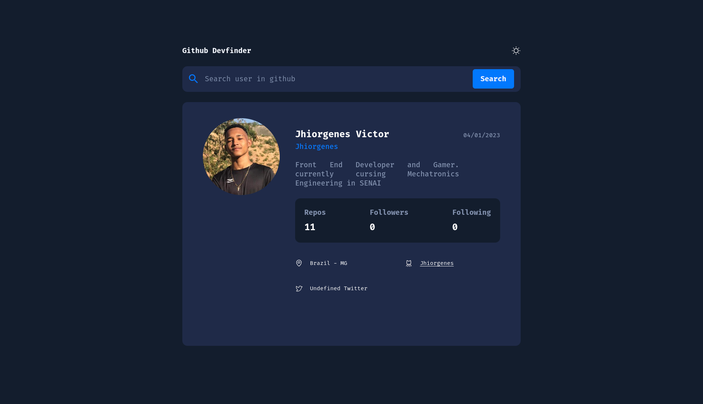

  <a href="#-Technologies">
Technologies</a>&nbsp;&nbsp;&nbsp;|&nbsp;&nbsp;&nbsp;
  <a href="#-Project">Project</a>&nbsp;&nbsp;&nbsp;|&nbsp;&nbsp;&nbsp;
  <a href="#-Layout">Layout</a>&nbsp;&nbsp;&nbsp;

 

  

## 🚀 Technologies

This project was developed with the following technologies:

- HTML
- CSS
- JavaScript

Libraries

- [Google Fonts](https://fonts.google.com/)

Utilities

- [github api](https://api.github.com/)
- [phospor-icons](https://phosphoricons.com/)

## 💻 Project

Page made to improve knowledge in HTML, CSS and JS

## 🔖 Layout

You can view the project layout through [this link](https://www.figma.com/file/IOFo0QtcvKUfRz2swzEFbu/Github-Devfinder?node-id=60%3A223&t=la7VS4gdTmcKSubJ-0). You must have an account at [Figma](https://figma.com) to access it.
